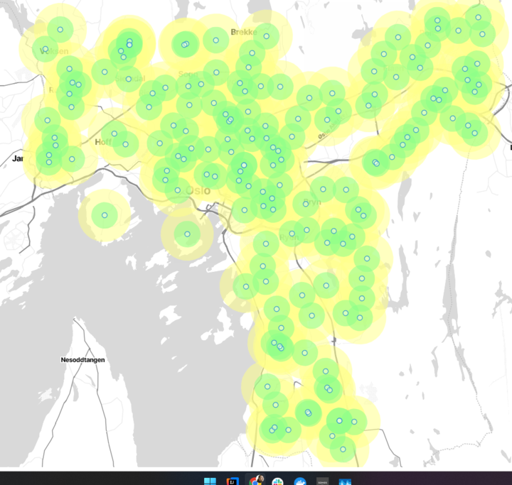
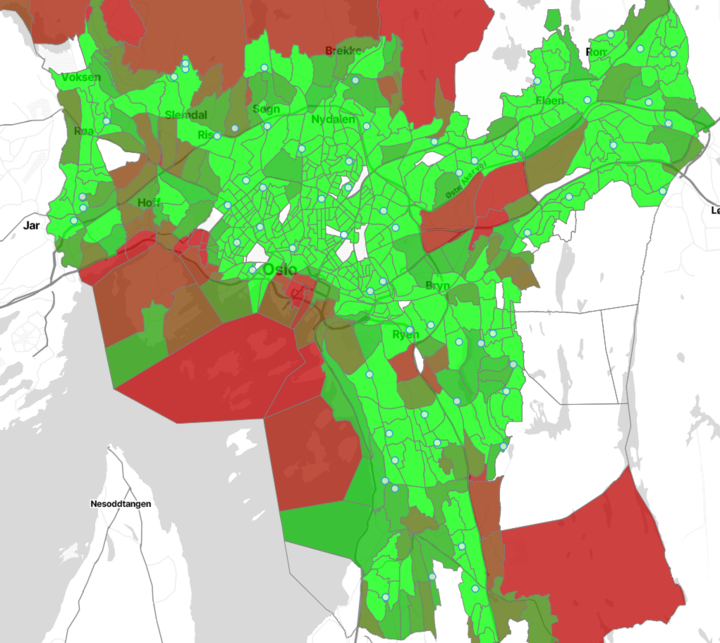

# Lecture 11: Advanced geographical queries:

In this lecture, we will explore some more features of PostGIS. We will
use `ST_Buffer` to create circles around points:

## `ST_Buffer(skole.posisjon, 1000)` and `ST_Buffer(skole.posisjon, 500)` in a map

## `ST_DWithin`

Here, we count the percentage of addresses in each statistical geographical area in Oslo
which are more than 750 meters away from the closest school.

